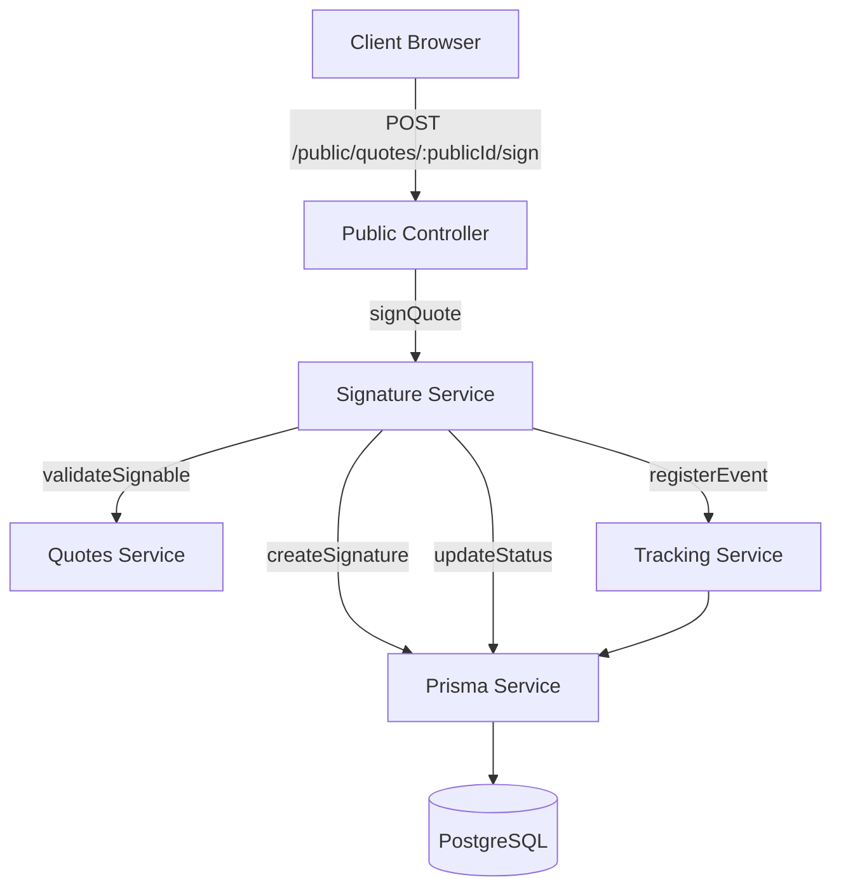

# Design Document: Electronic Signature

## Overview

This design document specifies the technical implementation for the electronic signature feature in QuoteFast. The feature enables clients to digitally sign quotes from the public view, capturing both the signature image and audit metadata (signer name, timestamp, IP address, user-agent).

The implementation extends the existing public quotes module with a new signature endpoint and data model. When a quote is signed, the system:
1. Validates the signature data (name, image format/size)
2. Stores the signature with audit metadata in a new `Signature` table
3. Transitions the quote status from SENT/VIEWED to SIGNED
4. Creates a QUOTE_SIGNED tracking event
5. Handles concurrent signature attempts with optimistic locking

The design follows existing patterns in the codebase:
- NestJS service architecture with dependency injection
- Prisma ORM for database operations
- Property-based testing with fast-check for validation logic
- Tracking service integration for audit events
- Public controller pattern for unauthenticated endpoints

### Key Design Decisions

**Signature Storage Strategy**: Store signature images as base64-encoded strings in the database rather than external file storage. This simplifies the initial implementation and ensures atomic transactions. For a 5MB limit, base64 encoding results in ~6.7MB storage per signature, which is acceptable for PostgreSQL's text type. Future optimization could move to S3/CloudFront if storage costs become significant.

**Status Model Extension**: Add a new SIGNED status to the QuoteStatus enum rather than reusing ACCEPTED. This provides clearer semantics and allows for future workflows where a signed quote might still need additional approval steps before being fully accepted.

**Concurrency Control**: Use Prisma's optimistic locking pattern by checking the current status before update. If multiple requests arrive simultaneously, only the first will succeed in transitioning from SENT/VIEWED to SIGNED. Subsequent requests will receive a 409 Conflict error.

**Validation Approach**: Implement validation at both the DTO level (class-validator) and service level. Image validation includes format checking (base64 data URI with image/* MIME type) and size validation before decoding to prevent DoS attacks.

## Architecture

### System Context



The signature feature integrates into the existing public quotes module. The flow:
1. Client submits signature via public endpoint (no authentication required)
2. Public controller extracts IP/user-agent from request and delegates to SignatureService
3. SignatureService validates quote is in signable state (SENT or VIEWED)
4. Service validates signature data (name, image format/size)
5. Service creates signature record and updates quote status in a transaction
6. TrackingService records QUOTE_SIGNED event with metadata
7. Response returns signature ID, new status, and timestamp

### Module Structure

```
src/
├── public/
│   ├── dto/
│   │   └── sign-quote.dto.ts          # Request validation
│   ├── public.controller.ts           # Add signQuote endpoint
│   ├── public.module.ts               # Register SignatureService
│   ├── public-quotes.service.ts       # Existing service
│   └── signature.service.ts           # New signature service
├── quotes/
│   └── quotes.service.ts              # Status validation helper
└── tracking/
    └── tracking.service.ts            # Event registration
```

### Database Schema Changes

Add new Signature model and extend QuoteStatus enum:

```prisma
enum QuoteStatus {
  DRAFT
  SENT
  VIEWED
  ACCEPTED
  REJECTED
  EXPIRED
  SIGNED      // New status
}

enum TrackingEventType {
  QUOTE_OPENED
  QUOTE_VIEWED
  QUOTE_ACCEPTED
  QUOTE_REJECTED
  QUOTE_PDF_DOWNLOADED
  QUOTE_EXPIRED
  QUOTE_SIGNED  // New event type
}

model Signature {
  id             String   @id @default(uuid())
  quoteId        String   @unique  // One signature per quote
  signerName     String   @db.VarChar(255)
  signatureImage String   @db.Text  // Base64 encoded image
  ipAddress      String?
  userAgent      String?
  signedAt       DateTime @default(now())
  createdAt      DateTime @default(now())
  updatedAt      DateTime @updatedAt
  
  quote          Quote    @relation(fields: [quoteId], references: [id], onDelete: Cascade)
  
  @@index([quoteId])
}

model Quote {
  // ... existing fields ...
  signedAt       DateTime?  // New field
  signature      Signature? // One-to-one relation
  // ... rest of model ...
}
```

## Components and Interfaces

### SignatureService

Core service responsible for signature processing and validation.

```typescript
interface SignatureService {
  /**
   * Process a quote signature
   * @throws NotFoundException if quote doesn't exist
   * @throws BadRequestException if validation fails
   * @throws ConflictException if quote already signed or not in signable state
   */
  signQuote(params: {
    publicId: string;
    signerName: string;
    signatureImage: string;
    ipAddress?: string;
    userAgent?: string;
  }): Promise<SignatureResponse>;
  
  /**
   * Validate signature image format and size
   * @throws BadRequestException if invalid
   */
  validateSignatureImage(image: string): void;
  
  /**
   * Validate signer name
   * @throws BadRequestException if invalid
   */
  validateSignerName(name: string): void;
}

interface SignatureResponse {
  id: string;
  quoteStatus: QuoteStatus;
  signedAt: Date;
}
```

### SignQuoteDto

Request validation DTO using class-validator:

```typescript
class SignQuoteDto {
  @IsString()
  @IsNotEmpty()
  @MaxLength(255)
  @Transform(({ value }) => value?.trim())
  signerName: string;
  
  @IsString()
  @IsNotEmpty()
  @Matches(/^data:image\/(png|jpeg|jpg|webp);base64,/)
  signatureImage: string;
}
```

### Public Controller Extension

Add new endpoint to existing PublicController:

```typescript
@Controller('public/quotes')
export class PublicController {
  @Post(':publicId/sign')
  @ApiOperation({ summary: 'Sign a quote' })
  @ApiResponse({ status: 200, type: SignatureResponse })
  @ApiResponse({ status: 400, description: 'Invalid signature data' })
  @ApiResponse({ status: 404, description: 'Quote not found' })
  @ApiResponse({ status: 409, description: 'Quote not in signable state' })
  async signQuote(
    @Param('publicId') publicId: string,
    @Body() dto: SignQuoteDto,
    @Req() request: Request,
  ): Promise<SignatureResponse> {
    const ipAddress = request.ip;
    const userAgent = request.headers['user-agent'];
    
    return this.signatureService.signQuote({
      publicId,
      signerName: dto.signerName,
      signatureImage: dto.signatureImage,
      ipAddress,
      userAgent,
    });
  }
}
```

## Data Models

### Signature Entity

```typescript
interface Signature {
  id: string;              // UUID
  quoteId: string;         // Foreign key to Quote
  signerName: string;      // Max 255 chars, trimmed
  signatureImage: string;  // Base64 data URI, max 5MB original
  ipAddress: string | null;
  userAgent: string | null;
  signedAt: Date;          // Timestamp of signature
  createdAt: Date;
  updatedAt: Date;
}
```

### Validation Rules

**Signer Name**:
- Required (not empty after trim)
- Max 255 characters
- Trimmed of leading/trailing whitespace
- Sanitized to prevent XSS (handled by Prisma parameterization)

**Signature Image**:
- Required (not empty)
- Must be valid base64 data URI
- Format: `data:image/{type};base64,{data}`
- Allowed types: png, jpeg, jpg, webp
- Max size: 5MB (original image before base64 encoding)
- Size validation: decode base64, check length ≤ 5MB

**IP Address & User Agent**:
- Optional fields
- Extracted from request headers
- Stored for audit purposes

### State Transitions

Valid quote status transitions for signing:

```
SENT → SIGNED    ✓ Valid
VIEWED → SIGNED  ✓ Valid
DRAFT → SIGNED   ✗ Invalid (400)
ACCEPTED → SIGNED ✗ Invalid (409)
REJECTED → SIGNED ✗ Invalid (409)
EXPIRED → SIGNED  ✗ Invalid (409)
SIGNED → SIGNED   ✓ Valid (idempotent, replaces signature)
```

## Correctness Properties

*A property is a characteristic or behavior that should hold true across all valid executions of a system—essentially, a formal statement about what the system should do. Properties serve as the bridge between human-readable specifications and machine-verifiable correctness guarantees.*


### Property Reflection

After analyzing all acceptance criteria, I identified the following redundancies:

**Persistence Properties (3.1-3.6)**: All these properties test that data is stored and can be retrieved. These can be consolidated into a single comprehensive "signature data round-trip" property that validates all fields are persisted correctly.

**Event Metadata Properties (5.2-5.5)**: These all test that specific fields are included in the tracking event. These can be combined into one property that validates all required metadata is present in the event.

**Response Structure Properties (7.2-7.4)**: These all test that specific fields are in the response. These can be combined into one property that validates the complete response structure.

**Validation Properties (2.3, 6.4, 9.4, 9.5)**: Properties about accepting valid inputs and rejecting invalid inputs can be consolidated. The edge cases (6.1, 6.2, 6.3) will be handled by the generator in the property test.

**State Transition Properties (4.1, 4.2)**: These both test the outcome of successful signing. They can be combined into one property about the complete state transition.

**Idempotence Properties (3.7, 10.1, 10.2, 10.3)**: These all test aspects of signing multiple times. They can be consolidated into one comprehensive idempotence property.

### Property 1: Only Signable States Accept Signatures

*For any* quote with status other than SENT or VIEWED, attempting to sign the quote should result in a rejection error (400 or 409).

**Validates: Requirements 1.3**

### Property 2: Valid Names Are Accepted

*For any* string that is non-empty after trimming and has length ≤ 255 characters, the name validation should accept it as a valid signer name.

**Validates: Requirements 2.3, 9.4**

### Property 3: Invalid Names Are Rejected

*For any* string that is empty after trimming, contains only whitespace, or exceeds 255 characters, the name validation should reject it with a 400 error.

**Validates: Requirements 2.3, 6.1, 6.2, 9.5**

### Property 4: Invalid Image Formats Are Rejected

*For any* string that is not a valid base64 data URI with an image MIME type (png, jpeg, jpg, webp), the image validation should reject it with a 400 error.

**Validates: Requirements 6.4**

### Property 5: Validation Failures Return 400 Errors

*For any* invalid signature data (invalid name or invalid image), the service should return a 400 Bad Request error.

**Validates: Requirements 2.5**

### Property 6: Signature Data Round-Trip

*For any* valid signature submission (valid name, valid image, valid IP, valid user-agent), after signing a quote, retrieving the signature from the database should return all the submitted data unchanged (name, image, IP, user-agent, and quoteId association).

**Validates: Requirements 3.1, 3.2, 3.3, 3.4, 3.5, 3.6**

### Property 7: Successful Signing Transitions State to SIGNED

*For any* quote in SENT or VIEWED status, successfully signing the quote should result in the quote status being SIGNED and the signedAt timestamp being set to a recent value.

**Validates: Requirements 4.1, 4.2**

### Property 8: Tracking Event Created with Complete Metadata

*For any* successful signature, a QUOTE_SIGNED tracking event should be created with the correct quoteId and metadata containing the IP address, user-agent, and signer name.

**Validates: Requirements 5.1, 5.2, 5.3, 5.4, 5.5**

### Property 9: Response Contains Complete Signature Data

*For any* successful signature, the response should contain a valid signature ID (UUID format), the quote status (SIGNED), and a signedAt timestamp.

**Validates: Requirements 7.2, 7.3, 7.4**

### Property 10: Signature Idempotence

*For any* quote that is signed multiple times with different signature data, the system should maintain only one signature record containing the most recent signature data, and the quote status should remain SIGNED.

**Validates: Requirements 3.7, 10.1, 10.2, 10.3**

## Error Handling

### Error Scenarios and Responses

**Quote Not Found (404)**:
- Scenario: publicId does not exist in database
- Response: `{ statusCode: 404, message: 'Quote not found' }`
- Handling: Check quote existence before any validation

**Invalid Signature Data (400)**:
- Scenarios:
  - Signer name empty/whitespace-only
  - Signer name exceeds 255 characters
  - Signature image empty
  - Signature image not valid base64 data URI
  - Signature image wrong MIME type
  - Signature image exceeds 5MB (decoded size)
- Response: `{ statusCode: 400, message: '<specific validation error>', error: 'Bad Request' }`
- Handling: Validate all inputs before database operations

**Quote Not Signable (409)**:
- Scenarios:
  - Quote status is DRAFT
  - Quote status is ACCEPTED
  - Quote status is REJECTED
  - Quote status is EXPIRED
- Response: `{ statusCode: 409, message: 'Quote cannot be signed in its current state', error: 'Conflict' }`
- Handling: Check quote status before creating signature

**Concurrent Signature Attempts (409)**:
- Scenario: Multiple simultaneous sign requests for same quote
- Response: `{ statusCode: 409, message: 'Quote signature conflict', error: 'Conflict' }`
- Handling: Use database transaction with status check; first request succeeds, others fail

**Database Errors (500)**:
- Scenarios: Connection failures, constraint violations, transaction deadlocks
- Response: `{ statusCode: 500, message: 'Internal server error' }`
- Handling: Log error details, return generic message to client

### Error Handling Strategy

1. **Input Validation First**: Validate all inputs (name, image) before any database operations to fail fast
2. **Existence Check**: Verify quote exists before validation to provide clear 404 errors
3. **State Validation**: Check quote is in signable state before creating signature
4. **Transactional Operations**: Wrap signature creation and quote update in a transaction to ensure atomicity
5. **Graceful Degradation**: If tracking event creation fails, log error but don't fail the signature operation
6. **Detailed Logging**: Log all errors with context (publicId, validation failures, stack traces) for debugging

### Validation Implementation

```typescript
// Name validation
validateSignerName(name: string): void {
  const trimmed = name.trim();
  if (trimmed.length === 0) {
    throw new BadRequestException('Signer name cannot be empty');
  }
  if (trimmed.length > 255) {
    throw new BadRequestException('Signer name cannot exceed 255 characters');
  }
}

// Image validation
validateSignatureImage(image: string): void {
  // Check format
  const dataUriRegex = /^data:image\/(png|jpeg|jpg|webp);base64,(.+)$/;
  const match = image.match(dataUriRegex);
  
  if (!match) {
    throw new BadRequestException(
      'Signature image must be a valid base64 data URI with image MIME type'
    );
  }
  
  // Check size (decode and measure)
  const base64Data = match[2];
  const sizeInBytes = Buffer.from(base64Data, 'base64').length;
  const maxSizeInBytes = 5 * 1024 * 1024; // 5MB
  
  if (sizeInBytes > maxSizeInBytes) {
    throw new BadRequestException(
      'Signature image cannot exceed 5MB'
    );
  }
}
```

## Testing Strategy

### Dual Testing Approach

The electronic signature feature requires both unit tests and property-based tests for comprehensive coverage:

**Unit Tests** focus on:
- Specific examples of valid signatures
- Edge cases (empty strings, boundary lengths, specific invalid formats)
- Integration between SignatureService and dependencies (PrismaService, TrackingService)
- Error scenarios with specific inputs
- Mock verification for service interactions

**Property-Based Tests** focus on:
- Universal validation rules across all possible inputs
- State transition correctness for all quote statuses
- Data persistence round-trips with random valid data
- Idempotence across multiple signature attempts
- Response structure validation with varied inputs

Together, these approaches ensure both concrete correctness (unit tests catch specific bugs) and general correctness (property tests verify rules hold universally).

### Property-Based Testing Configuration

**Library**: fast-check (already used in the codebase)

**Configuration**:
- Minimum 100 iterations per property test
- Each test tagged with comment referencing design property
- Tag format: `Feature: electronic-signature, Property {number}: {property_text}`

**Test Organization**:
```
test/backend/src/public/
├── signature.service.ts
├── signature.service.spec.ts              # Unit tests
├── signature.validation.pbt.spec.ts       # Properties 2, 3, 4, 5
├── signature.persistence.pbt.spec.ts      # Property 6
├── signature.state-transitions.pbt.spec.ts # Properties 1, 7
├── signature.tracking.pbt.spec.ts         # Property 8
├── signature.response.pbt.spec.ts         # Property 9
└── signature.idempotence.pbt.spec.ts      # Property 10
```

### Property Test Examples

**Property 2: Valid Names Are Accepted**
```typescript
/**
 * Feature: electronic-signature, Property 2: Valid Names Are Accepted
 * 
 * For any string that is non-empty after trimming and has length ≤ 255 characters,
 * the name validation should accept it as a valid signer name.
 */
it('P2: accepts all valid signer names', async () => {
  await fc.assert(
    fc.asyncProperty(
      fc.string({ minLength: 1, maxLength: 255 }).filter(s => s.trim().length > 0),
      async (name) => {
        // Should not throw
        service.validateSignerName(name);
        return true;
      }
    ),
    { numRuns: 100 }
  );
});
```

**Property 6: Signature Data Round-Trip**
```typescript
/**
 * Feature: electronic-signature, Property 6: Signature Data Round-Trip
 * 
 * For any valid signature submission, after signing a quote, retrieving the signature
 * from the database should return all the submitted data unchanged.
 */
it('P6: signature data persists correctly', async () => {
  await fc.assert(
    fc.asyncProperty(
      fc.record({
        signerName: fc.string({ minLength: 1, maxLength: 255 }),
        signatureImage: fc.constantFrom(
          'data:image/png;base64,iVBORw0KGgoAAAANSUhEUgAAAAEAAAABCAYAAAAfFcSJAAAADUlEQVR42mNk+M9QDwADhgGAWjR9awAAAABJRU5ErkJggg==',
          'data:image/jpeg;base64,/9j/4AAQSkZJRgABAQEAYABgAAD/2wBDAAgGBgcGBQgHBwcJCQgKDBQNDAsLDBkSEw8UHRofHh0aHBwgJC4nICIsIxwcKDcpLDAxNDQ0Hyc5PTgyPC4zNDL/2wBDAQkJCQwLDBgNDRgyIRwhMjIyMjIyMjIyMjIyMjIyMjIyMjIyMjIyMjIyMjIyMjIyMjIyMjIyMjIyMjIyMjIyMjL/wAARCAABAAEDASIAAhEBAxEB/8QAFQABAQAAAAAAAAAAAAAAAAAAAAv/xAAUEAEAAAAAAAAAAAAAAAAAAAAA/8QAFQEBAQAAAAAAAAAAAAAAAAAAAAX/xAAUEQEAAAAAAAAAAAAAAAAAAAAA/9oADAMBAAIRAxEAPwCwAA8A/9k='
        ),
        ipAddress: fc.ipV4(),
        userAgent: fc.string()
      }),
      async (data) => {
        const quote = await createTestQuote({ status: QuoteStatus.SENT });
        
        const result = await service.signQuote({
          publicId: quote.publicId,
          ...data
        });
        
        const signature = await prisma.signature.findUnique({
          where: { id: result.id }
        });
        
        return (
          signature.signerName === data.signerName.trim() &&
          signature.signatureImage === data.signatureImage &&
          signature.ipAddress === data.ipAddress &&
          signature.userAgent === data.userAgent &&
          signature.quoteId === quote.id
        );
      }
    ),
    { numRuns: 100 }
  );
});
```

### Unit Test Coverage

Unit tests should cover:

1. **Happy Path**:
   - Sign a SENT quote successfully
   - Sign a VIEWED quote successfully
   - Verify response structure

2. **Validation Edge Cases**:
   - Empty string name (after trim)
   - Whitespace-only name
   - Name exactly 255 characters
   - Name 256 characters
   - Empty image string
   - Invalid base64 format
   - Wrong MIME type (e.g., data:text/plain)
   - Image exactly 5MB
   - Image 5MB + 1 byte

3. **State Validation**:
   - Attempt to sign DRAFT quote
   - Attempt to sign ACCEPTED quote
   - Attempt to sign REJECTED quote
   - Attempt to sign EXPIRED quote
   - Attempt to sign already SIGNED quote (should succeed, replace)

4. **Integration**:
   - Verify PrismaService.signature.create called with correct data
   - Verify PrismaService.quote.update called with SIGNED status
   - Verify TrackingService.registerEvent called with QUOTE_SIGNED
   - Verify transaction rollback on error

5. **Error Handling**:
   - Quote not found (invalid publicId)
   - Database connection error
   - Transaction conflict

### Test Data Generators

For property-based tests, create custom generators:

```typescript
// Valid signer names
const validSignerName = fc.string({ minLength: 1, maxLength: 255 })
  .filter(s => s.trim().length > 0);

// Invalid signer names
const invalidSignerName = fc.oneof(
  fc.constant(''),
  fc.constant('   '),
  fc.string({ minLength: 256, maxLength: 300 })
);

// Valid signature images (small sample set for performance)
const validSignatureImage = fc.constantFrom(
  'data:image/png;base64,iVBORw0KGgoAAAANSUhEUgAAAAEAAAABCAYAAAAfFcSJAAAADUlEQVR42mNk+M9QDwADhgGAWjR9awAAAABJRU5ErkJggg==',
  'data:image/jpeg;base64,/9j/4AAQSkZJRgABAQEAYABgAAD...',
  'data:image/webp;base64,UklGRiQAAABXRUJQVlA4IBgAAAAwAQCdASoBAAEAAwA0JaQAA3AA/vuUAAA='
);

// Invalid signature images
const invalidSignatureImage = fc.oneof(
  fc.constant(''),
  fc.constant('not-a-data-uri'),
  fc.constant('data:text/plain;base64,SGVsbG8='),
  fc.string().filter(s => !s.startsWith('data:image/'))
);

// Signable quote statuses
const signableStatus = fc.constantFrom(QuoteStatus.SENT, QuoteStatus.VIEWED);

// Non-signable quote statuses
const nonSignableStatus = fc.constantFrom(
  QuoteStatus.DRAFT,
  QuoteStatus.ACCEPTED,
  QuoteStatus.REJECTED,
  QuoteStatus.EXPIRED
);
```

### Performance Testing

While not part of property-based testing, performance requirements should be validated:

- **Target**: 95th percentile response time < 500ms
- **Method**: Load testing with k6 or Artillery
- **Scenarios**:
  - 10 concurrent users signing different quotes
  - 100 requests/second sustained for 1 minute
  - Measure database query time, validation time, total response time
- **Monitoring**: Add timing logs to SignatureService methods

### Integration Testing

End-to-end tests should verify:

1. **Full Flow**:
   - POST /public/quotes/:publicId/sign with valid data
   - Verify 200 response with correct structure
   - GET quote and verify status is SIGNED
   - Verify signature record exists in database
   - Verify tracking event created

2. **Concurrent Signatures**:
   - Send 5 simultaneous sign requests for same quote
   - Verify exactly 1 succeeds with 200
   - Verify others fail with 409
   - Verify only 1 signature record exists

3. **Swagger Documentation**:
   - Verify endpoint appears in /api/docs
   - Verify request/response schemas are documented
   - Verify examples are present

