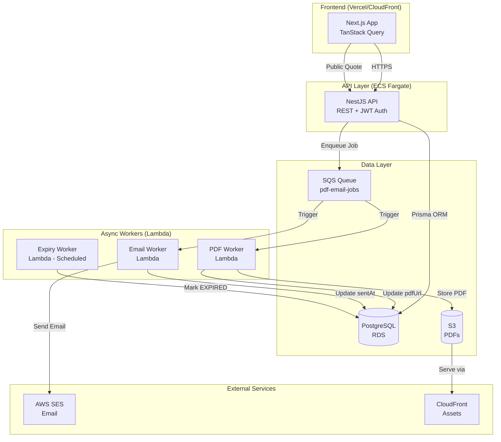
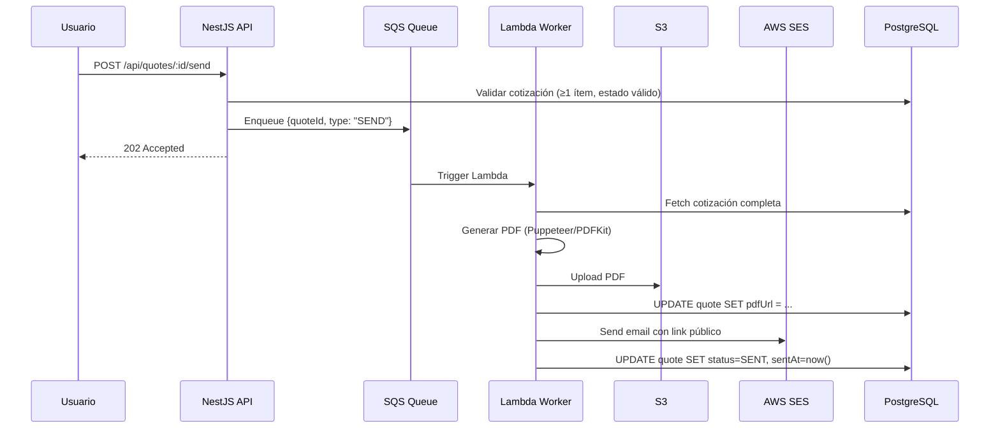
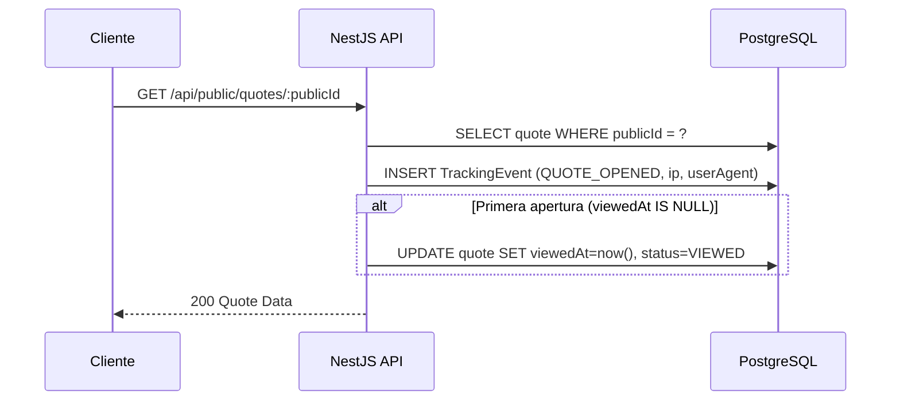
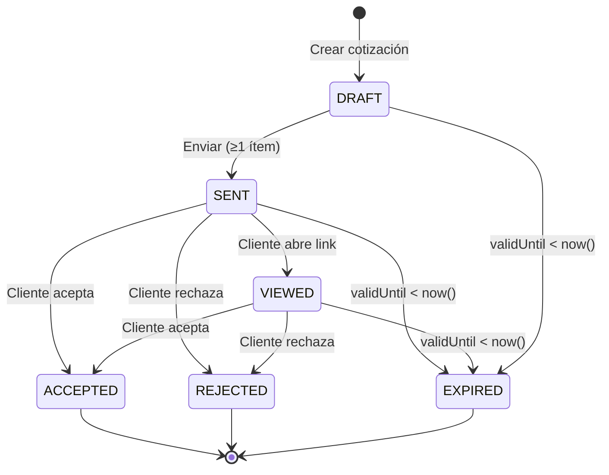

# Documento de Diseño: QuoteFast

## Visión General

QuoteFast es una plataforma SaaS multi-tenant para gestión del ciclo de vida de cotizaciones profesionales. La arquitectura sigue un modelo de capas desacopladas: una API REST en NestJS, workers asíncronos en AWS Lambda, almacenamiento en PostgreSQL/S3, y un frontend en Next.js.

El diseño prioriza:
- **Correctitud de cálculos**: Los totales de cotización son siempre derivados de los ítems, nunca almacenados de forma independiente sin recalcular.
- **Aislamiento multi-tenant**: Cada query a la base de datos incluye el `userId` del token JWT para garantizar que los usuarios solo accedan a sus propios datos.
- **Asincronía para operaciones costosas**: PDF y email se procesan en workers Lambda via SQS para no bloquear la API.
- **Trazabilidad**: Cada interacción del cliente con una cotización genera un TrackingEvent inmutable.

---

## Arquitectura



### Flujo de Envío de Cotización



### Flujo de Vista Pública y Tracking



---

## Componentes e Interfaces

### Módulos NestJS

| Módulo | Responsabilidad |
|--------|----------------|
| `AuthModule` | Registro, login, refresh de tokens JWT |
| `ClientsModule` | CRUD de clientes con aislamiento por userId |
| `QuotesModule` | CRUD de cotizaciones, envío, duplicación |
| `QuoteItemsModule` | CRUD de ítems con recálculo de totales |
| `PublicModule` | Endpoints sin auth para vista pública, accept/reject |
| `TrackingModule` | Registro de TrackingEvents |
| `TemplatesModule` | CRUD de plantillas |
| `DashboardModule` | Agregaciones y métricas |
| `WorkersModule` | Handlers para mensajes SQS (PDF, email) |

### Interfaces Principales (TypeScript)

```typescript
// Resultado de cálculo de totales de cotización
interface QuoteTotals {
  subtotal: number;      // suma(item.quantity * item.unitPrice)
  taxAmount: number;     // subtotal * taxRate / 100
  total: number;         // subtotal + taxAmount - discount
}

// Payload del job SQS
interface QuoteJobPayload {
  quoteId: string;
  type: 'GENERATE_PDF' | 'SEND_EMAIL' | 'SEND_QUOTE';
  retryCount: number;
}

// Respuesta de vista pública
interface PublicQuoteResponse {
  publicId: string;
  title: string;
  status: QuoteStatus;
  currency: string;
  items: QuoteItemPublic[];
  subtotal: number;
  taxRate: number;
  taxAmount: number;
  discount: number;
  total: number;
  notes: string | null;
  terms: string | null;
  validUntil: Date | null;
  issuer: { name: string; company: string | null };
  client: { name: string; company: string | null };
}
```

### Máquina de Estados de Cotización



**Transiciones válidas:**

| Estado Origen | Evento | Estado Destino | Condición |
|--------------|--------|----------------|-----------|
| DRAFT | send | SENT | ≥1 ítem |
| SENT | client_open | VIEWED | Primera apertura |
| SENT/VIEWED | client_accept | ACCEPTED | - |
| SENT/VIEWED | client_reject | REJECTED | - |
| DRAFT/SENT/VIEWED | expiry_check | EXPIRED | validUntil < now() |

**Estados terminales:** ACCEPTED, REJECTED, EXPIRED (no permiten edición ni transición).

---

## Modelos de Datos

### Schema Prisma

```prisma
enum Plan {
  FREE
  PRO
  TEAM
  BUSINESS
}

enum QuoteStatus {
  DRAFT
  SENT
  VIEWED
  ACCEPTED
  REJECTED
  EXPIRED
}

enum TrackingEventType {
  QUOTE_OPENED
  QUOTE_VIEWED
  QUOTE_ACCEPTED
  QUOTE_REJECTED
  QUOTE_PDF_DOWNLOADED
  QUOTE_EXPIRED
}

model User {
  id            String   @id @default(uuid())
  email         String   @unique
  passwordHash  String
  name          String
  company       String?
  plan          Plan     @default(FREE)
  refreshToken  String?
  createdAt     DateTime @default(now())
  updatedAt     DateTime @updatedAt
  quotes        Quote[]
  clients       Client[]
  templates     Template[]
}

model Client {
  id        String   @id @default(uuid())
  userId    String
  name      String
  email     String?
  company   String?
  phone     String?
  address   String?
  notes     String?
  createdAt DateTime @default(now())
  updatedAt DateTime @updatedAt
  user      User     @relation(fields: [userId], references: [id])
  quotes    Quote[]
}

model Quote {
  id          String      @id @default(uuid())
  publicId    String      @unique @default(uuid())
  userId      String
  clientId    String?
  title       String
  status      QuoteStatus @default(DRAFT)
  currency    String      @default("USD")
  subtotal    Decimal     @default(0) @db.Decimal(12, 2)
  taxRate     Decimal     @default(0) @db.Decimal(5, 2)
  taxAmount   Decimal     @default(0) @db.Decimal(12, 2)
  total       Decimal     @default(0) @db.Decimal(12, 2)
  discount    Decimal     @default(0) @db.Decimal(12, 2)
  notes       String?
  terms       String?
  validUntil  DateTime?
  pdfUrl      String?
  sentAt      DateTime?
  viewedAt    DateTime?
  acceptedAt  DateTime?
  rejectedAt  DateTime?
  createdAt   DateTime    @default(now())
  updatedAt   DateTime    @updatedAt
  user        User        @relation(fields: [userId], references: [id])
  client      Client?     @relation(fields: [clientId], references: [id])
  items       QuoteItem[]
  trackingEvents TrackingEvent[]
}

model QuoteItem {
  id          String   @id @default(uuid())
  quoteId     String
  name        String
  description String?
  quantity    Decimal  @db.Decimal(10, 2)
  unitPrice   Decimal  @db.Decimal(12, 2)
  total       Decimal  @db.Decimal(12, 2)
  order       Int
  createdAt   DateTime @default(now())
  updatedAt   DateTime @updatedAt
  quote       Quote    @relation(fields: [quoteId], references: [id], onDelete: Cascade)
}

model TrackingEvent {
  id        String            @id @default(uuid())
  quoteId   String
  eventType TrackingEventType
  metadata  Json?
  ipAddress String?
  userAgent String?
  createdAt DateTime          @default(now())
  quote     Quote             @relation(fields: [quoteId], references: [id])
}

model Template {
  id        String   @id @default(uuid())
  userId    String?
  name      String
  content   Json
  isDefault Boolean  @default(false)
  createdAt DateTime @default(now())
  updatedAt DateTime @updatedAt
  user      User?    @relation(fields: [userId], references: [id])
}
```

### Lógica de Cálculo de Totales

La función de cálculo es pura y determinista. Se ejecuta en el servicio de backend cada vez que se modifica un ítem:

```typescript
function calculateQuoteTotals(
  items: Array<{ quantity: number; unitPrice: number }>,
  taxRate: number,
  discount: number
): QuoteTotals {
  const subtotal = items.reduce(
    (sum, item) => sum + item.quantity * item.unitPrice,
    0
  );
  const taxAmount = subtotal * (taxRate / 100);
  const total = subtotal + taxAmount - discount;
  return { subtotal, taxAmount, total };
}
```

**Invariantes de cálculo:**
- `subtotal >= 0` siempre (cantidad y precio son no-negativos)
- `taxAmount >= 0` siempre (taxRate es no-negativo)
- `total = subtotal + taxAmount - discount`
- Si `discount > subtotal + taxAmount`, el total puede ser negativo (se permite, el usuario es responsable)

---

## Propiedades de Corrección

*Una propiedad es una característica o comportamiento que debe mantenerse verdadero en todas las ejecuciones válidas del sistema. Las propiedades sirven como puente entre las especificaciones legibles por humanos y las garantías de corrección verificables por máquina.*

### Propiedad 1: Corrección del cálculo de subtotal

*Para cualquier* lista de ítems de cotización con cantidades y precios unitarios no-negativos, el subtotal calculado debe ser igual a la suma de `(cantidad * precioUnitario)` de cada ítem.

**Valida: Requisito 3.5, 3.6**

### Propiedad 2: Corrección del cálculo de taxAmount

*Para cualquier* subtotal no-negativo y tasa de impuesto entre 0 y 100, el taxAmount calculado debe ser igual a `subtotal * taxRate / 100`.

**Valida: Requisito 3.6**

### Propiedad 3: Corrección del total de cotización

*Para cualquier* combinación válida de subtotal, taxAmount y descuento, el total debe ser igual a `subtotal + taxAmount - descuento`.

**Valida: Requisito 3.6**

### Propiedad 4: Idempotencia del recálculo de totales

*Para cualquier* cotización con ítems, aplicar la función de cálculo de totales dos veces consecutivas debe producir el mismo resultado que aplicarla una sola vez.

**Valida: Requisito 3.6**

### Propiedad 5: Transiciones de estado válidas

*Para cualquier* cotización en un estado dado, solo las transiciones definidas en la máquina de estados son permitidas. Específicamente, una cotización en estado ACCEPTED o REJECTED no puede transicionar a ningún otro estado.

**Valida: Requisito 3.7, 6.4, 7.3**

### Propiedad 6: viewedAt se actualiza solo una vez

*Para cualquier* cotización, sin importar cuántos TrackingEvents de tipo QUOTE_OPENED se registren, el campo `viewedAt` debe tener el valor de la primera apertura y no cambiar en aperturas subsecuentes.

**Valida: Requisito 5.4, 5.5**

### Propiedad 7: Unicidad del publicId

*Para cualquier* conjunto de cotizaciones en el sistema, no deben existir dos cotizaciones con el mismo `publicId`.

**Valida: Requisito 3.2**

### Propiedad 8: Límite del plan FREE

*Para cualquier* usuario en plan FREE, el número de cotizaciones creadas en el mes calendario actual nunca debe exceder 5. Intentar crear la cotización número 6 debe resultar en error 403.

**Valida: Requisito 8.1, 8.2**

### Propiedad 9: Inmutabilidad de cotizaciones terminales

*Para cualquier* cotización en estado ACCEPTED, REJECTED o EXPIRED, cualquier intento de modificar sus campos o ítems debe ser rechazado con error 422.

**Valida: Requisito 3.7**

### Propiedad 10: Aislamiento de datos por usuario

*Para cualquier* usuario autenticado, las queries de listado de cotizaciones, clientes y plantillas deben retornar únicamente recursos cuyo `userId` coincida con el del token JWT.

**Valida: Requisito 3.8, 2.3, 12.1, 12.2**

### Propiedad 11: Consistencia de totales tras modificación de ítems

*Para cualquier* cotización, después de agregar, editar o eliminar un ítem, los campos `subtotal`, `taxAmount` y `total` almacenados en la base de datos deben ser consistentes con los valores calculados a partir de los ítems actuales.

**Valida: Requisito 3.6**

### Propiedad 12: Expiración no afecta estados terminales

*Para cualquier* cotización en estado ACCEPTED o REJECTED con `validUntil` en el pasado, el proceso de expiración automática no debe cambiar su estado.

**Valida: Requisito 7.3**

---

## Manejo de Errores

### Códigos de Error Estándar

| Código | Situación |
|--------|-----------|
| 400 | Payload inválido (validación de campos) |
| 401 | Token JWT ausente, expirado o inválido |
| 403 | Límite de plan alcanzado |
| 404 | Recurso no encontrado o no pertenece al usuario |
| 409 | Conflicto (email duplicado, cliente con cotizaciones) |
| 422 | Operación no permitida en el estado actual |
| 429 | Rate limit excedido |
| 500 | Error interno del servidor |

### Estrategia de Reintentos para Workers

Los workers Lambda implementan reintentos con backoff exponencial:
- Intento 1: inmediato
- Intento 2: 30 segundos después
- Intento 3: 5 minutos después
- Tras 3 fallos: mover mensaje a Dead Letter Queue (DLQ) y alertar

### Manejo de Errores en Cálculos

- Cantidades y precios negativos son rechazados en validación (error 400) antes de llegar a la capa de cálculo.
- División por cero no es posible en la fórmula de cálculo (taxRate se divide entre 100, no entre sí mismo).
- Overflow numérico: se usa `Decimal` de Prisma con precisión `(12, 2)` para evitar errores de punto flotante.

---

## Estrategia de Testing

### Enfoque Dual: Tests Unitarios + Tests de Propiedades

Se requieren ambos tipos de tests de forma complementaria:

- **Tests unitarios**: Verifican ejemplos específicos, casos borde y condiciones de error.
- **Tests de propiedades (PBT)**: Verifican propiedades universales sobre rangos amplios de inputs generados aleatoriamente.

### Librería de Property-Based Testing

Se usará **`fast-check`** para TypeScript/Node.js. Cada test de propiedad debe ejecutar mínimo **100 iteraciones**.

Formato de tag para cada test:
```
Feature: saas-quote-platform, Property {N}: {texto de la propiedad}
```

### Tests Unitarios

Cubren:
- Validaciones de DTOs (class-validator)
- Guards de autenticación JWT
- Lógica de transición de estados (casos específicos)
- Manejo de errores en workers (mock de SQS/SES)
- Endpoints de la API con mocks de Prisma

### Tests de Propiedades (PBT)

Cada propiedad del documento de diseño debe tener exactamente un test de propiedad:

| Propiedad | Test |
|-----------|------|
| P1: Subtotal | `fc.array(fc.record({quantity: fc.float({min:0}), unitPrice: fc.float({min:0})}))` → verificar suma |
| P2: taxAmount | `fc.float({min:0}), fc.float({min:0, max:100})` → verificar multiplicación |
| P3: Total | Combinación de P1+P2 + descuento → verificar fórmula |
| P4: Idempotencia | Aplicar `calculateTotals` dos veces → mismo resultado |
| P5: Transiciones | Generar estado aleatorio + evento → verificar máquina de estados |
| P6: viewedAt una vez | Simular N aperturas → verificar que viewedAt no cambia tras la primera |
| P7: Unicidad publicId | Generar N cotizaciones → verificar que todos los publicIds son únicos |
| P8: Límite FREE | Generar 1-10 cotizaciones para usuario FREE → verificar error en la 6ta |
| P9: Inmutabilidad terminal | Estado terminal + operación de edición → verificar error 422 |
| P10: Aislamiento | Generar usuarios y recursos → verificar que queries filtran por userId |
| P11: Consistencia tras modificación | Modificar ítems → verificar totales en DB |
| P12: Expiración no afecta terminales | Estado ACCEPTED/REJECTED + validUntil pasado → verificar que no cambia |

### Tests de Integración

- Flujo completo: crear cotización → agregar ítems → enviar → simular apertura → aceptar
- Flujo de expiración: crear cotización con validUntil pasado → ejecutar worker → verificar EXPIRED
- Flujo de límite FREE: crear 5 cotizaciones → verificar error en la 6ta
